# Twain 💜

Twain is a shared app for couples to stay connected through small, meaningful moments.

From synced wallpapers to sweet notes, shared memories, and location sharing, Twain gives couples a simple space to feel closer even when they’re apart.

---

## What Twain does

Twain focuses on lightweight, thoughtful interactions between partners:

- **Wallpaper Sync**  
  Set a wallpaper once and sync it instantly with your partner’s phone.

- **Wallpaper Rotation (Plus)**  
  Create folders of wallpapers that rotate automatically over time.

- **Sticky Notes**  
  Leave short, sweet messages your partner can see anytime.

- **Shared Board**  
  Save photos and moments you both care about in one shared space.

- **Location Sharing**  
  Share your location with your partner to feel connected throughout the day.

- **Notifications**  
  Get notified when your partner sends a note, updates a wallpaper, or shares something new.

Twain is designed to be calm, personal, and intentional, not another noisy chat app.

---

## Screenshots

### Home screen

  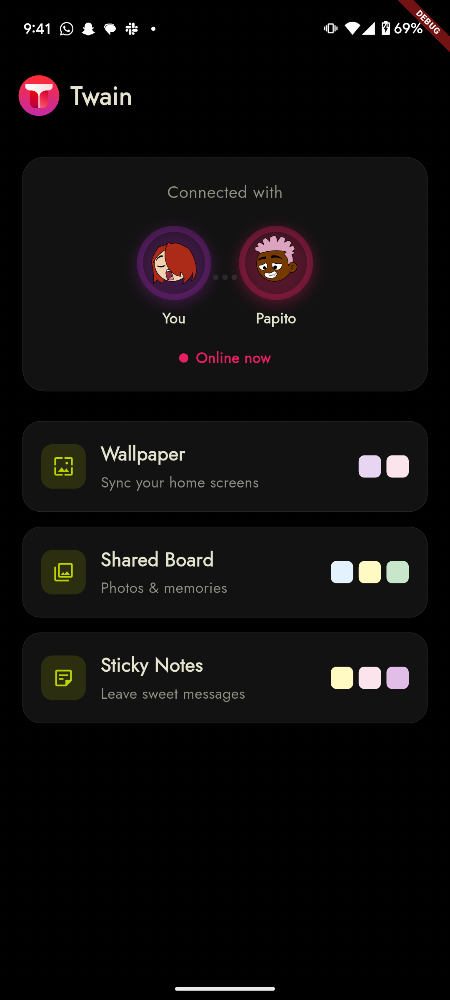
  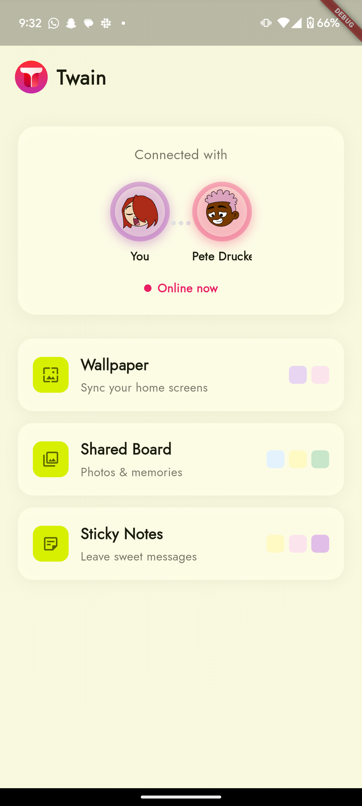

### Wallpaper sync

  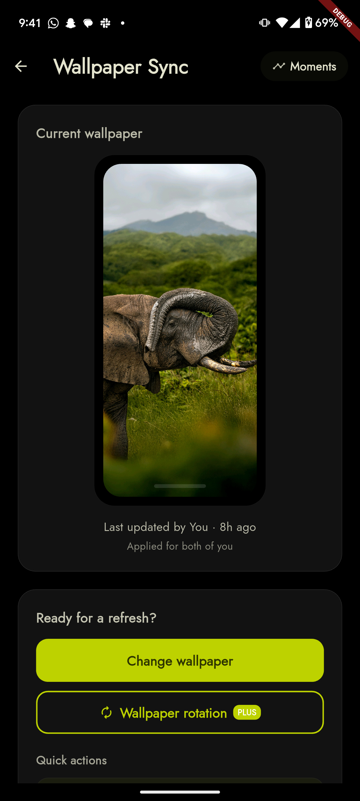
  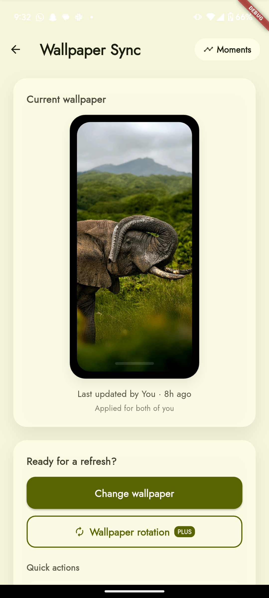

### Browse wallpapers

  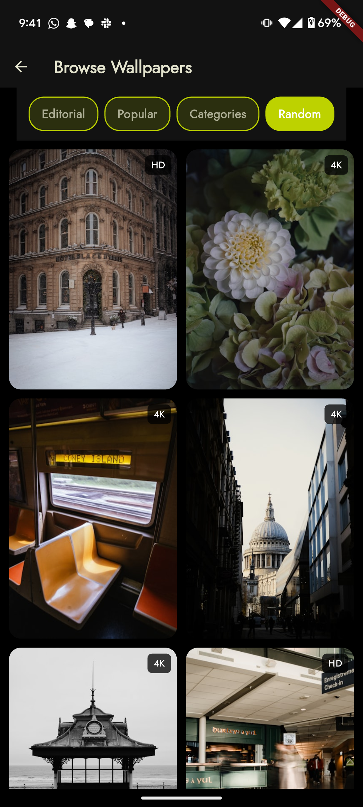
  

### Wallpaper preview

  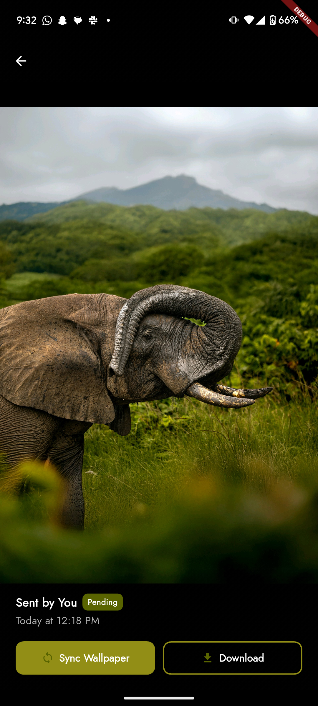

### Shared board

  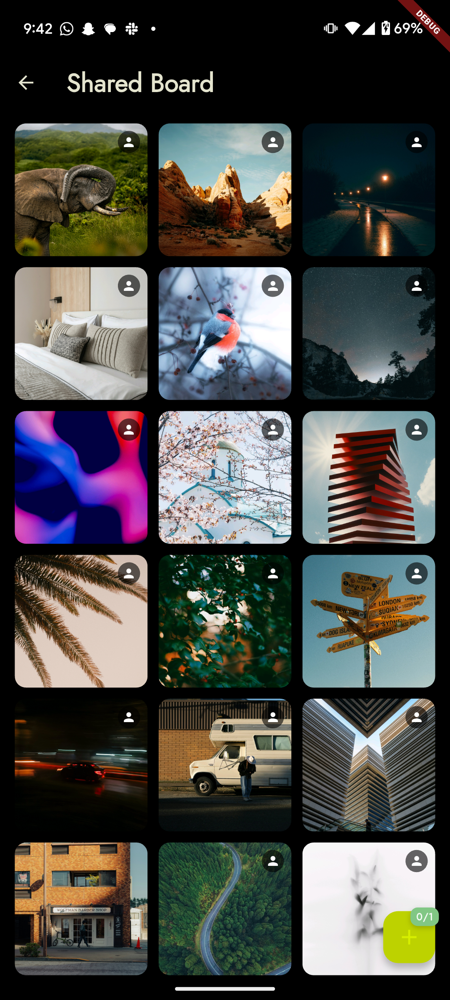
  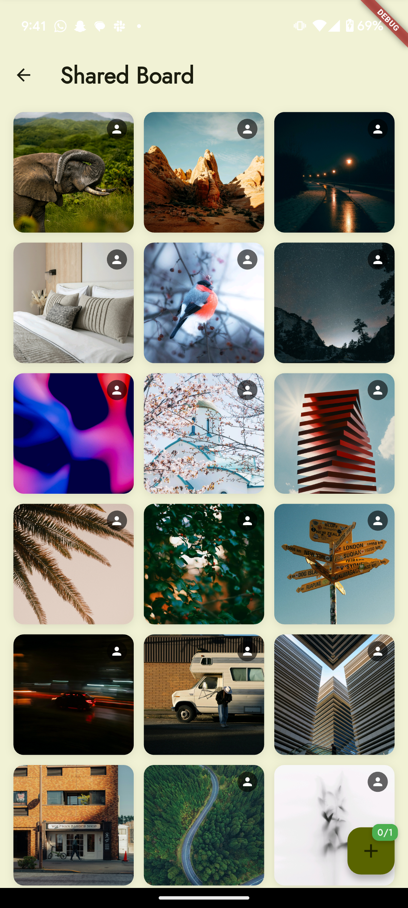

### Sticky notes

  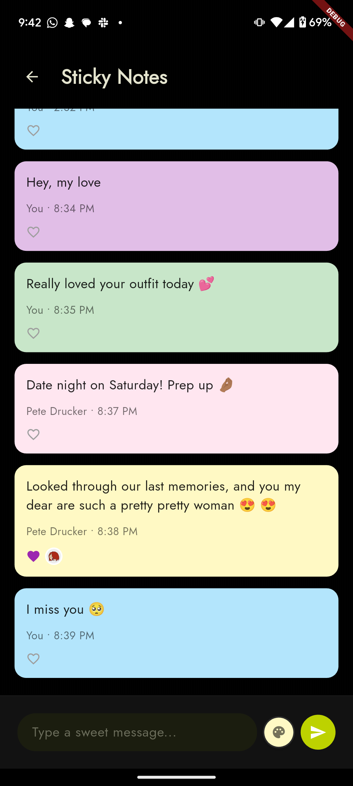
  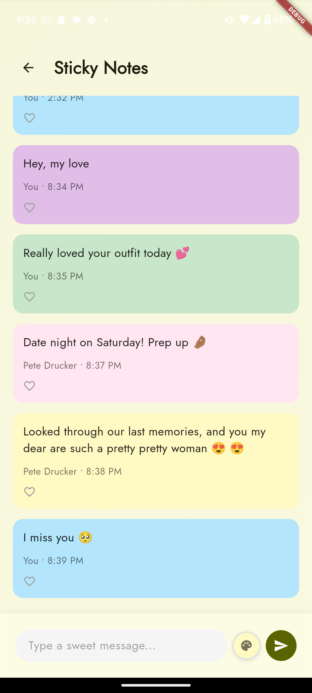

### User profile

  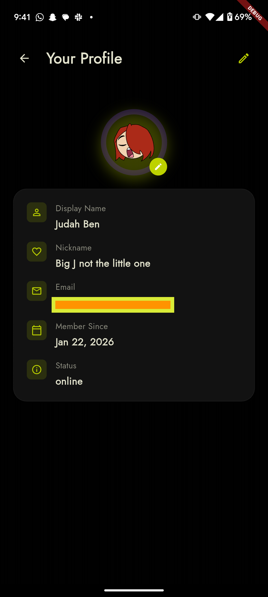
  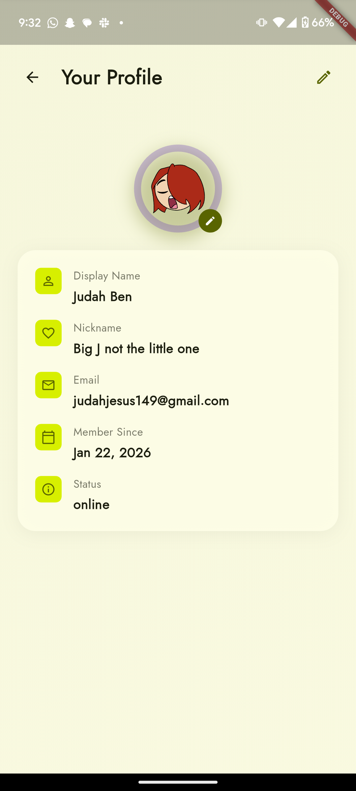

### Settings

  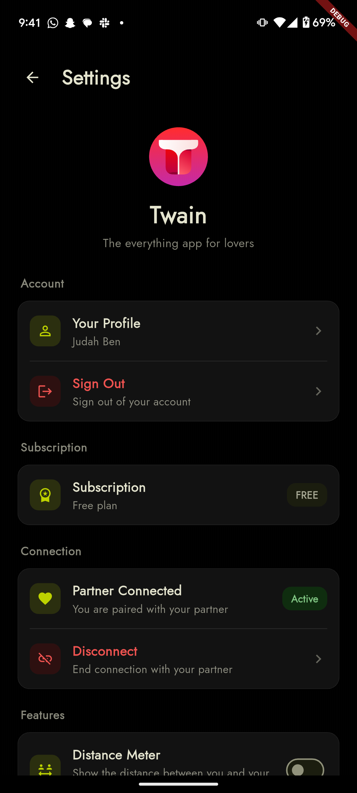
  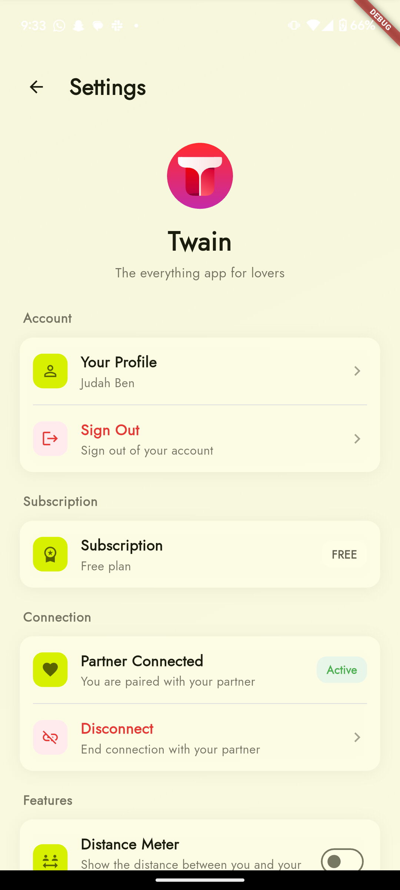

  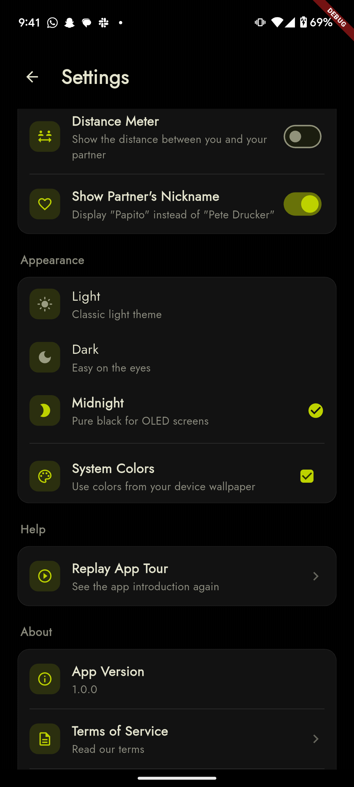
  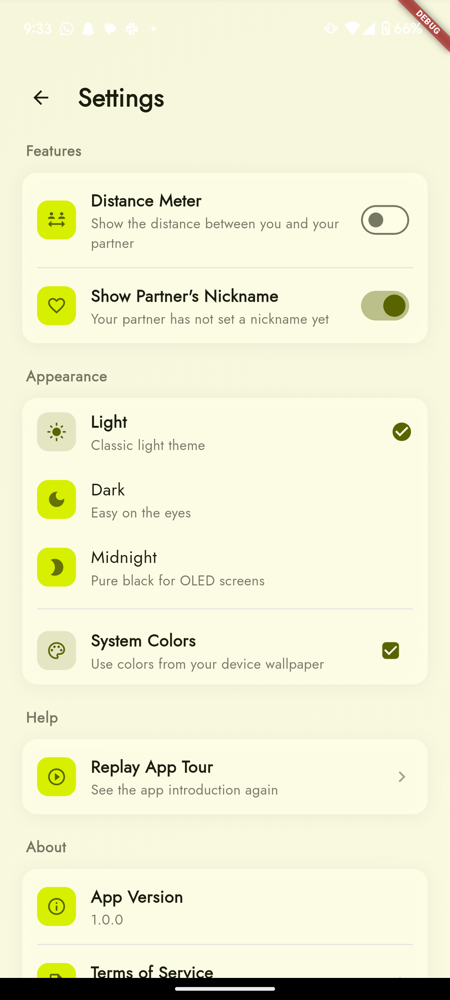

---

## Twain Plus

Twain includes an optional subscription, Twain Plus, which unlocks additional features such as:

- Wallpaper rotation  
- Deeper interactions with shared notes  
- Future premium features as they’re added  

Subscriptions are managed through the App Store and Google Play.

---

## Tech Stack

- Flutter (mobile app)
- Supabase (authentication, database, storage)
- RevenueCat (subscriptions and paywalls)
- Unsplash API (wallpaper browsing)
- Platform notification services (push notifications)

---

## Privacy and Safety

- Twain is built and operated by an individual developer.
- User data is stored securely using Supabase.
- Location sharing and notifications are fully optional and controlled by the user.
- Users should only connect with people they trust.

For full details, see the [Terms of Service](https://twain-legal-site.vercel.app/terms.html) and [Privacy Policy](https://twain-legal-site.vercel.app/privacy.html).

---

## Project Status

Twain is an actively developed project.

Features may change, improve, or expand over time as feedback is collected and new ideas are explored.

---

## Contact

For questions, feedback, or issues:

Email: judahben149@gmail.com

---

## Why Twain

Twain exists to support the small, everyday moments that help relationships feel closer — without trying to replace real conversations.

Sometimes, a shared wallpaper or a simple note is enough.

